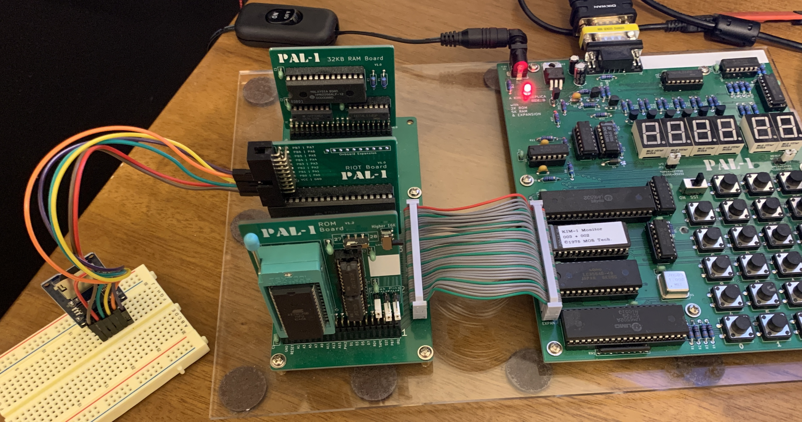

Forked from https://github.com/gfoot/sdcard6502/ and modified to work with my PAL-1. Code can be assembled with ca65.

# How to read and write SD cards with a 6532, step by step

This guide shows how to connect up an SD card reader to a PAL-1 6502 and use it to read/write data from SDHC cards.

The tutorial ends with being able to read arbitrary sectors from the SDHC card.
Beyond that, I've included library-style code that can read/write from a FAT32 filesystem,
with some example programs.  For more information on this library code, see
[FAT32 Library Documentation](doc/FAT32Library.md)

I'm only covering SDHC cards.  You pretty much can't buy older/smaller
cards these days, and not bothering to support the older protocol simplifies
the code quite a bit.

# Contents

### Intro
* [0a Prerequisites and References](doc/0a_Prereqs.md)
* [0b About the Sample Code](doc/0b_SampleCode.md)
* [0c Initial Hardware Setup](doc/0c_HardwareSetup.md)

### Samples
* [1  Reading and Writing Bytes](doc/1_ReadingWritingBytes.md)
* [2  Encaplusated sd\_sendcommand](doc/2_SendCommand.md)
* [3  Complete Initialization Sequence](doc/3_Initialization.md)
* [4  Reading Sectors](doc/4_ReadingSectors.md)
* [6  Reading File Content](src/test_dumpfile.s)
  
  
  
### Appendices
* [A  Next Steps](doc/A_NextSteps.md)
* [B  Older SD/MMC Cards](doc/B_OlderCards.md)

